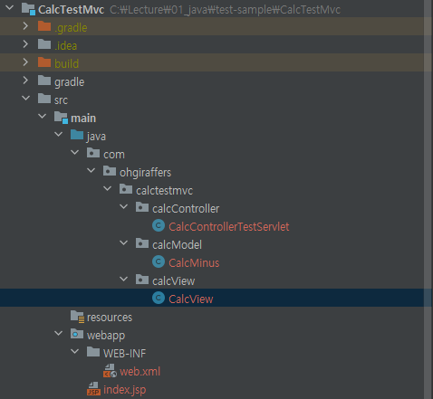

# ServerMaker-Calc-Test

---
## 프로젝트 소개

--- 
* 사칙연산을 수행하는 계산기 만들기

---
## 요구사항
* 사칙연산이 수학적으로 통용되는 상식선에서 정상적으로 돌아가도록 구현
* 모든 사칙 연산은 정수로 계산되도록 할 것 
  * 사칙 연산은 +, -, *, /, % 다섯 가지가 수행되도록 한다.
  * 다섯가지 연산자 외의 다른 기호가 입력된 경우 IllegalArgumentException이 발생하며 에러 메세지는 "(잘못입력한 기호 출력)잘못된 연산자가 입력되었습니다.". 라는 화면이 출력되도록 한다.
* 나누기의 경우 나눌 수가 0인 경우 IllegalArgumentException이 발생
  * 나눌 수가 0인 경우 에러가 발생하며 "0으로는 나눌 수 없습니다." 라는 화면이 출력되도록 한다.
* doPost 방식으로 정보의 전달
* forward 방식

---
## 제약사항

---
* servlet은 하나로 보여준다.
* 가독성 있는 코드로 작성
* 메소드 이름은 반드시 명령문 형태
* 테스트 메소드 충분히 검증
* 개인의 구현은 반드시 브랜치 생성 후 구현
* 모든 작업이 끝난 후 Pull Request 생성
* PR에 모든 팀원이 코드 리뷰
* 마지막 리뷰어는 Merge 수행

---
## 패키지 구조
